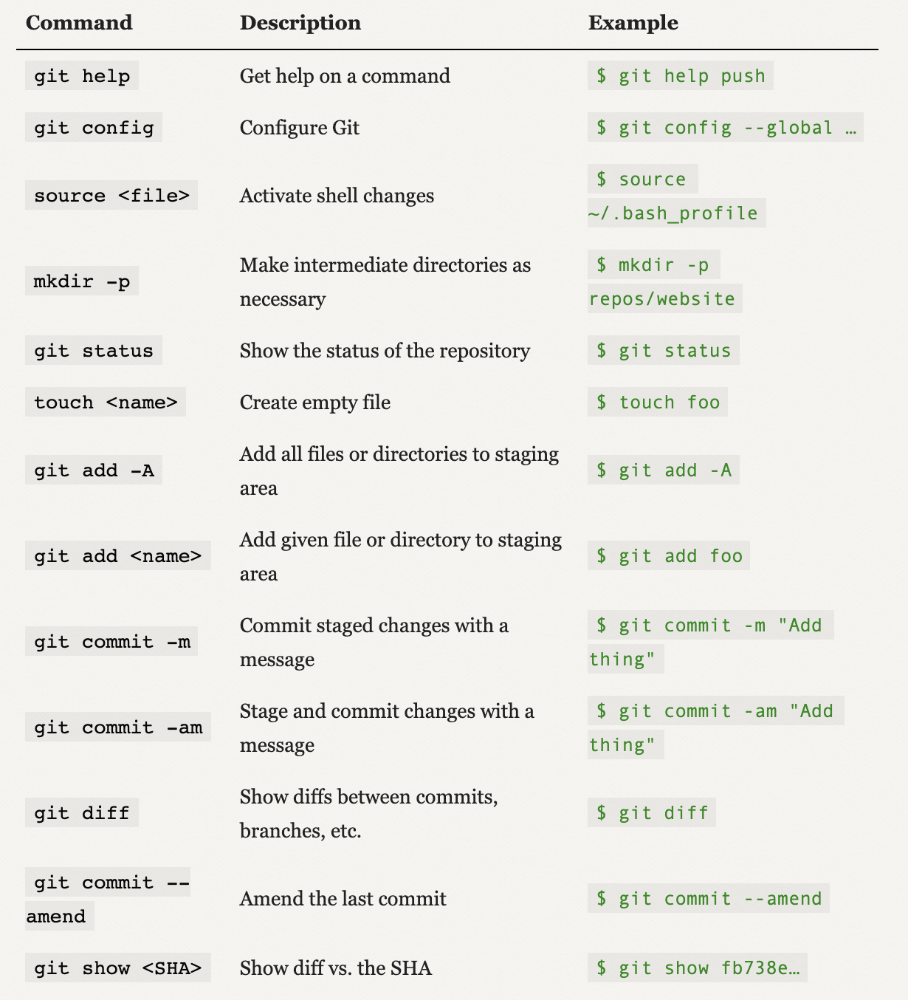
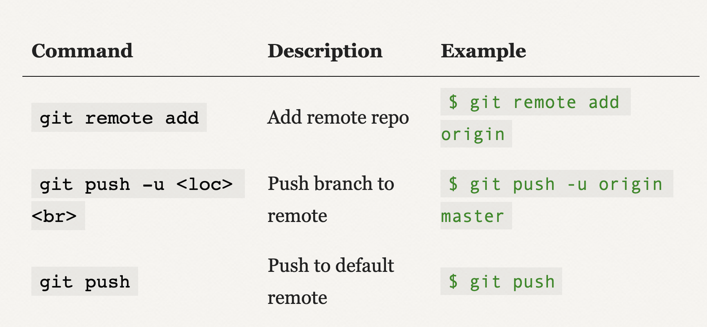
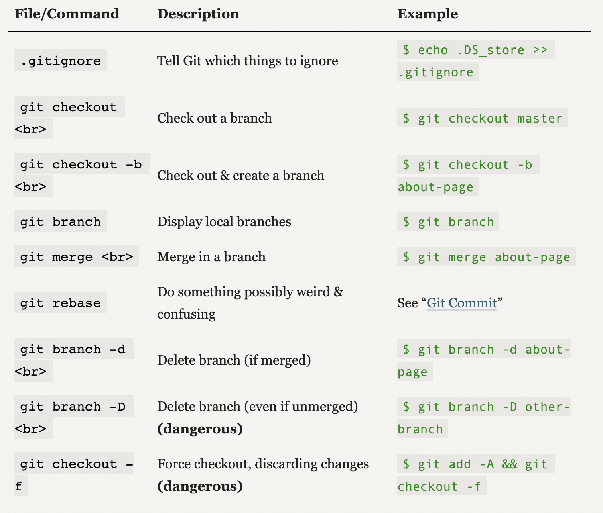
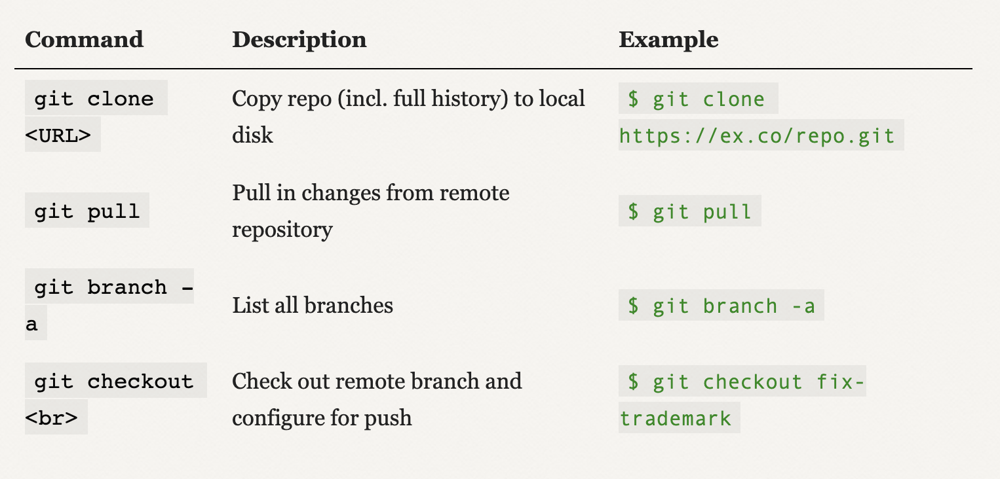

# Working with Images 

> How to display an image using matplotlib?

1. Get the image in an array
2. Use `plt.imshow(array)`

> How to display one channel image?


> Display an image with python?

There are several ways.
[stackoverflow answer here](https://stackoverflow.com/questions/35286540/display-an-image-with-python)

# Research

> Boosted sampling implementation 

```
# Initial conditions 

# losses_nobatch = []
losses= []
sample_size =128
batch_size = 32
boostloss = None
t_min = 0
t_max = 2*np.pi
batch_count1 = 0
# Network 

mlp = HarNet()
loss_fn = VanillaLoss()
optimer = optim.Adam(mlp.parameters(),lr=0.001,betas = (0.9,0.997)) 

for j in range(50):

    num_epochs = 10
    for i in range(num_epochs):
        t_tensor = torch.from_numpy(np.random.uniform(t_min,t_max,sample_size)).type(torch.Tensor).view(-1,1)
        ######################
        if boostloss == None:
            batch_size = 2
        elif 2**(-int(torch.log(boostloss)) - 2) < 1:
            batch_size = 2
        else:
            batch_size = 2**(-int(torch.log(boostloss)) - 2)
        ######################
        batchlist = batches(t_tensor,batch_size=batch_size)
        for batch in batchlist:
            loss = loss_fn(mlp, batch)
            loss.backward()
            optimer.step()
            optimer.zero_grad()
            batch_count1 +=1
        boostloss = loss_fn(mlp,t_tensor).detach()
        losses.append(boostloss)
```

> Batching implementation 

```
def batches(train_examples_t,batch_size=16):
    batched = []
    train_examples_t = train_examples_t.reshape((-1, 1))
    n_examples_train = train_examples_t.shape[0]
    idx = np.random.permutation(n_examples_train)

    batch_start, batch_end = 0, batch_size
    while batch_start < n_examples_train:
        if batch_end > n_examples_train:
            batch_end = n_examples_train
        batch_idx = idx[batch_start:batch_end]
        ts = train_examples_t[batch_idx]
        batched.append(ts)
        batch_start += batch_size
        batch_end += batch_size
    return batched
```

> PPppBoost implementation 

```
def boost_sample_unbiased(ts,loss,prev, num_points = 16,knob=0,memory=0,bins=10,t_min=0,t_max=2*np.pi):
    if loss is None:
        return torch.from_numpy(np.random.uniform(t_min,t_max,num_points)).type(torch.Tensor).view(-1,1), bins*[int((num_points*knob)/(bins))]
    else:
        f = interp1d(ts.numpy().reshape(-1,), loss.detach().numpy().reshape(-1,))
        tinterp = np.linspace(ts.min().numpy(),ts.max().numpy(),bins)
        # fix the sample size
        
#         samplesizes = [int(i*knob)  for i in 2*math.ceil(num_points/bins)*(1 - (f(tinterp)/np.sum(f(tinterp))))]
        samplesizes = [int(i*knob)  for i in num_points*((f(tinterp)/np.sum(f(tinterp))))]        
        samplesizes[samplesizes.index(max(samplesizes))] = max(samplesizes)+ int(num_points*knob) - sum(samplesizes)
        samplesizes = [int(i*(1-memory) + memory*j) for i,j in zip(samplesizes,prev)]        
        intervals = [((i*(t_max - t_min)/bins) + t_min) for i in range(bins+1)]         
        t_sample = []
        for i,val in enumerate(intervals[:-1]):
            t_sample.extend(np.random.uniform(val,intervals[i+1],samplesizes[i]))
        if len(t_sample) < num_points:
            t_sample.extend(np.random.uniform(t_min,t_max,num_points-len(t_sample)))        
#             t_sample.extend(np.random.uniform(ts.min(),ts.max(),num_points-len(t_sample)))        
        t_sample = np.array(t_sample)  
        t_tensor= torch.from_numpy(t_sample).view(-1,1).type(torch.Tensor)
        return t_tensor.view(-1,1),samplesizes
```
> Plotting the loss over t

```
t_plot, loss_plot = list(zip(*sorted(zip(*(t_tensor,boostloss.detach().numpy())))))
fig, ax = plt.subplots(figsize = (10,6))
 
ax.set_xlabel('$t$',fontsize=12)
ax.set_ylabel('$Loss$',fontsize=14)
ax.plot(t_plot, [2*i for i in loss_plot],color = 'k',label = 'Loss over $t$')
ax.set_xticks(np.arange(0, 2*np.pi+0.01, np.pi/2))
labels = ['$0$', r'$\pi/2$', r'$\pi$'
          , r'$3\pi/2$', r'$2\pi$']
ax.set_xticklabels(labels)
ax.legend()
```

> Reparametrization function 

```
def repar(t,nn):
    return 1. + torch.mul((1-torch.exp(-t))**2, nn(t))
```

> Taking the nth derivative 

def nth_derivative(f, wrt, n):

    for i in range(n):

        grads = grad(list(f), wrt, create_graph=True, allow_unused=False)[0]
        f = grads
        if grads is None:
            print('bad grad')
            return torch.tensor(0.)
    return grads


> Customized deep neural network in pytorch

```
class HarNet(nn.Module):

    def __init__(self):
        super().__init__()
#         torch.manual_seed(22)
        self.linear1 = nn.Linear(1,32) 
#         torch.manual_seed(22)
        self.linear2 = nn.Linear(32,32)
#         torch.manual_seed(22)
        self.linear3 = nn.Linear(32,1)

  
    def forward(self, x):

        x = torch.tanh(self.linear1(x)) 
        x = torch.tanh(self.linear2(x))
        x = self.linear3(x)
        return x
```

> Custom loss function in pytorch


```
class VanillaLoss(nn.Module):
    def __init__(self):
        super().__init__()
        
    
    # Forward method
    def forward(self,net, batch,eta=0,delta=1):
        
        # Vanilla Loss
        batch.requires_grad_(True)
        x = repar(batch,net)
        d2x = nth_derivative(x,batch,n=2)
        loss = (d2x+x)**2
        loss = loss.mean()
        batch.requires_grad_(False)

        return loss

```

> Tensor Dataset and Train dataloader
```
train_data = TensorDataset(t_tensor, x_tensor)
train_loader = DataLoader(dataset=train_data, batch_size=80, shuffle=True)
```

> Pytorch .fit implementation

```
def make_train_step(model, loss_function, optimizer, eta=0,delta=1):
    def train_step(t):
        
        model.train()
        loss = loss_function(model,t,eta=eta,delta=delta)
        loss.backward()
        optimizer.step()
        loss = loss_function(model,t)
        optimizer.zero_grad()
        
        return loss.item()
    return train_step
```

> Training example in pytorch

```
n_epochs = 80
for epoch in range(n_epochs):
    for t_batch, x_batch in train_loader:
        loss = train_step(t_batch)
    losses.append(loss)
```

> Recording a video of loss over t vs sampling distribution

```
fig,axes = plt.subplots(1,1,figsize=(7,5))
camera = Camera(fig)


losses = []
sample_size = 128
bins = 12
t_tensor = None
boostloss = None
prev_sample = bins*[0]
num_epochs = 5
num_reps = 100

for rep in range(num_reps):
    
    for epoch in range(num_epochs):
        t_tensor,prev_sample  = boost_sample_unbiased(t_tensor,boostloss,prev_sample, num_points=sample_size,knob=1,memory=0.9,bins=bins)
        batchlist = batches(t_tensor,batch_size=32)
        for batch in batchlist:
            loss = loss_fn(mlp, batch)
            loss.backward()
            optimer.step()
            optimer.zero_grad()
        t_tensor = torch.from_numpy(np.random.uniform(0,2*np.pi,sample_size)).type(torch.Tensor).view(-1,1)
        losses.append(loss_fn(mlp,t_tensor))

    t_tensor.requires_grad_(True)
    x = repar(t_tensor,mlp)
    d2x = nth_derivative(x,t_tensor,n=2)
    boostloss = (d2x+x)**2
    t_tensor.requires_grad_(False);

    t2,prev_sample  = boost_sample_unbiased(t_tensor,boostloss,prev_sample, num_points=sample_size,knob=1,memory=0.9,bins=bins)    
    t_plot, loss_plot = list(zip(*sorted(zip(*(t_tensor,boostloss.detach().numpy())))))


    axes.plot(t_plot, [4*i for i in loss_plot],color = '#575759')

    axes.hist(t2.numpy(),density=True,color = '#385ed1',bins=8,alpha=0.5,label = 'knob=1')
    axes.set_xlabel('$t$',fontsize=12)
    axes.set_ylabel('$x$',fontsize=12)
    axes.set_ylim([0,2])
    t = axes.plot([-0.01,0.01],[-2,-2],'-',color ='k')
    axes.legend(t,[f'Epoch: {5*(rep+1)} knob=1,memory=0.9'],fontsize=14,loc='upper left')
    axes.set_title('Sampling over loss',fontsize=14)    
    
    camera.snap()
```

# Terminal 

### Terminal commands

```
rm -i $(ls | grep google)
```

[How to remove selected files](https://unix.stackexchange.com/questions/247924/how-do-i-pipe-ls-to-grep-and-delete-the-files-filtered-by-grep)

### Texteditor

`ESC:q!` most important vim command

`1G` - First line

`18G` - 18th line

`\Rose` - searches for Rose in txt file

`dd` - Delete line

`p` - paste deleted line

# Tensorflow

> How to check tensorflow version?


Library import statements
```
#import tensorflow 
import tensorflow as tf
# You can avoid the long names by using
from tensorflow import keras
from tensorflow.keras import layers
from tensorflow.keras import models
%matplotlib inline
```

> Custom optimizer 
optimizer = tf.keras.optimizers.Adam(learning_rate=1e-3)

> Custom loss function

*Important to wrap it around another function*
```
# wrapper function to send loss function
def baseloss(t):
    
    with tf.GradientTape() as tape:
    

#     dx = der_x(t)
    def custom_loss(x_true,x_pred):
        x = bundle(t)
        loss = (dx+x)**2
        return loss
    
    return custom_loss
```

> Define neural network in `Sequential` itself
```
# Define your neural network

mlp = keras.Sequential(
    [   keras.layers.Input(shape=(1,)),
        keras.layers.Dense(100, activation=tf.nn.sigmoid,dtype='float32'),
        keras.layers.Dense(2, activation=keras.activations.linear)
    ]
)
```

> Non-fit training

```
# Define the loss function
loss_fn = tf.keras.losses.MSE

# Instantiate an optimizer
optimizer = tf.keras.optimizers.Adam(learning_rate=1e-3)

# Doing this for at least 100 epochs

# Define number of epochs

num_epochs = 20000

for i in range(epochs):

        # Open a GradientTape
        
        with tf.GradientTape() as tape:

            # Forward pass.
            output = mlp(x)

            # Loss value for this batch.
            loss = keras.backend.mean(loss_fn(output,targets))

        # Get gradients of weights wrt the loss.
        gradients = tape.gradient(loss, mlp.trainable_weights)

        # Update the weights of our linear layer.
        optimizer.apply_gradients(zip(gradients, mlp.trainable_weights))

```

## CNNs

- Terminology

What is a kernel?
> When we think about a neuron as a single thing that’s moved across the image (or applied in parallel with shared weights), we often call its weights a kernel or filter.

what is a Convolution?

> Convolution starts with two lists of numbers of equal length. Using our existing language, let’s call one list the input values, and the other list the weights. We then multiply the first input and the first weight, the second input and the second weight, and so on. When all the multipli- cations are done, the results are added together, and that’s the result of the operation.

What is 1x1 convolution filter?

> One powerful application of 1×1 convolution is to do feature reduction on the fly


[kaggle contest](https://machinelearningmastery.com/introduction-to-regularization-to-reduce-overfitting-and-improve-generalization-error/)


### Keras validation split in `ImageDataGenerator`

Find answer [here](https://stackoverflow.com/questions/42443936/keras-split-train-test-set-when-using-imagedatagenerator)


### Getting google file on colab

```
gdown https://drive.google.com/uc?id=0B7EVK8r0v71pOXBhSUdJWU1MYUk
```

More detailed answer [here](https://stackoverflow.com/questions/25010369/wget-curl-large-file-from-google-drive)


Useful link for downloading and unzipping files in colab [here](https://buomsoo-kim.github.io/colab/2020/05/04/Colab-downloading-files-from-web-2.md/)


### Questions

1. Both of these techniques work on the same general idea: the initial val- ues are random numbers that are chosen according to the number of inputs to the neuron? 

2. 

# Numpy

> Quick ways to make a matrix

`np.random.randn(3,1)`

# Git

[Submodules basic](https://chrisjean.com/git-submodules-adding-using-removing-and-updating/)


## Chapter 1


## Chapter 2


## Chapter 3


## Chapter 4


### Fish configuration
``` shell
function fish_prompt
    set_color normal
    # https://stackoverflow.com/questions/24581793/ps1-prompt-in-fish-friendly-interactive-shell-show-git-branch
    set -l git_branch (git branch 2>/dev/null | sed -n '/\* /s///p')
    echo -n (whoami)'@'(hostname)':'
    set_color $fish_color_cwd
    echo -n (prompt_pwd)
    set_color normal
    echo -n '{'
    set_color purple
    echo -n "$git_branch"
    set_color normal
    echo -n '}'
    echo -n ' $ '
end
```

# Matplotlib

> How to make xticks as multiples of $\pi$

[`ax.set_xticks(np.arange(0, 2*np.pi+0.01, np.pi/4))`](https://stackoverflow.com/questions/40642061/how-to-set-axis-ticks-in-multiples-of-pi-python-matplotlib)


## Plot snips

### Plotting images

```
import matplotlib.pyplot as plt
import matplotlib.image as mpimg
```

```
img = mpimg.imread('German_Shepherd.jpg');
ax.imshow(img)
```

Colors:

-   
- #9FC131FF (greenish)
- black
- #FF2F92 (pinkish)
- #336600 (dark green)
- #FF9A98 (reddish)
- #75B594 (greenish)

### Homework 1

1. Header

```
# Run this cell for more readable visuals 
large = 22; med = 16; small = 10
params = {'axes.titlesize': large,
          'legend.fontsize': med,
          'figure.figsize': (16, 10),
          'axes.labelsize': med,
          'axes.titlesize': med,
          'axes.linewidth': 2,
          'xtick.labelsize': med,
          'ytick.labelsize': med,
          'figure.titlesize': large}
plt.style.use('seaborn-whitegrid')
plt.rcParams.update(params)
#sns.set_style("white")
%matplotlib inline
```

2. EDA plots
```
fig.subplots_adjust(hspace =0.5, wspace=0.2)
```

3. Knn

```
fig, axs = plt.subplots(4,2, figsize=(20, 20), facecolor='w', edgecolor='k')
```

```
# To run a for loop
axs = axs.ravel()
```

```
ax.plot(xtrain, ytrain, '.', alpha=0.7, label='Train',markersize=10,color='#9FC131FF')
ax.plot(xtest, ytest, '.', alpha=0.7, label='Test',markersize=10,color='darkblue')
axs.plot(Xline, knn_model.predict(Xline), label='Predicted',color='black', linewidth=2)
```

4. MSE plot

```
ax.plot(K, mse_test, 's-', label='Test',color='darkblue',linewidth=2)
ax.plot(K, mse_train, 's--', label='Train',color='#9FC131FF',linewidth=2)
ax.set_xlabel(r'$K$ values', fontsize=15)
ax.set_ylabel('$MSE$', fontsize=15)
ax.set_title(r'$MSE$')
```

5. Linear regression

Scatter plot
```
plt.scatter(X_train,y_train,color='#FF2F92',label='Train data')
```

6. Residuals 

```
plt.axhline(color='black',linestyle='dashed')
```

7. Barplots

edgecolor='k'
```
ax.hist(df[df.gender==i].income, log=True, label = f'Gender type = {gendermap[i]}',alpha=0.4,color = colors[i], bins = 10,density=True,edgecolor='k' )
```

# Pandas helpful code

> How to one-hot encode?
```
pd.get_dummies(X_to_one_hot_encode)
```
> How to take the complement of a subdataframe?

```
df[~(df.name=='Hargun')]
```

Full stackoverflow answer [here](https://stackoverflow.com/questions/14986510/picking-out-elements-based-on-complement-of-indices-in-python-pandas)

> How to normalize a continuous dataframe column?
```
normalized_df=(df-df.mean())/df.std()
```

[Link to answer here](https://stackoverflow.com/questions/26414913/normalize-columns-of-pandas-data-frame#:~:text=You%20can%20apply%20a%20custom%20function%20to%20operate%20the%20DataFrame%20.&text=it%20takes%20mean%20for%20each,is%20the%20normalized%20data%20set.&text=The%20output%20values%20will%20be%20in%20range%20of%200%20and%201.)
> Hhow to find 95% confidence interval in a list?

Find the 2.5 percentile and the 97.5 percentile using

```
(np.percentile(list,2.5), np.percentile(list, 97.5))
```

> How to build a bootstrap?
```
def bootstrap(df):
    selectionIndex = np.random.randint(len(df), size = len(df))
    #selectionIndex = np.random.randint(___, size = ___)
    new_df = df.iloc[selectionIndex]
    #new_df = df.iloc[___]
    return new_df
```


> How to change datatype of a single column?

```
empDfObj['Marks'] = empDfObj['Marks'].astype('float64')
```
[Change datatype of pandas columns](https://thispointer.com/pandas-change-data-type-of-single-or-multiple-columns-of-dataframe-in-python/)

> How to create a pandas dataframe using a dictionary?

```
hardict = dict(A=listA, B=listB, C=listC)
df = pd.DataFrame(hardict)
```

>How to create a pandas dataframe using a list?

```
harlist=[]
#creation of dictionaries
for i in vals:
    harlist.append(dict(feature=i,B=valB, C=valC)))

df = pd.DataFrame(harlist)
```

>How to create a pandas dataframe from a numpy array?

```
pd.DataFrame(data=data[1:,1:],    # values
    index=data[1:,0],    # 1st column as index
    columns=data[0,1:])  # 1st row as the column names
```
[Creating pandas dataframe from numpy array](https://stackoverflow.com/questions/20763012/creating-a-pandas-dataframe-from-a-numpy-array-how-do-i-specify-the-index-colum)

>How to vectorize a function to apply on entire array?

[Vectorize function - map](https://stackoverflow.com/questions/35215161/most-efficient-way-to-map-function-over-numpy-array)


>How to make a mask?

```
mask = np.ones(size, dtype = 'int')
```

>Get a sampled collection

```
df.sample(size, replace = False)
```

>Shuffle data

```
df.sample(frac=1)
```

[Stackoverflow - How to shuffle a dataframe?](https://stackoverflow.com/questions/29576430/shuffle-dataframe-rows)


>Axis to left side

```
from matplotlib import pyplot as plt

f = plt.figure()
ax = f.add_subplot(111)
ax.yaxis.tick_right()
plt.plot([2,3,4,5])
plt.show()
```


>How to customize grids in subplots

```
fig3 = plt.figure(constrained_layout=True)
gs = fig3.add_gridspec(3, 3)
f3_ax1 = fig3.add_subplot(gs[0, :])
f3_ax1.set_title('gs[0, :]')
```

[Creating custom gridspaces](https://matplotlib.org/3.2.1/tutorials/intermediate/gridspec.html)

>Make a line chart with bar chart

```
fig = plt.figure()
ax = ts.plot(kind="bar")   # barchart
ax2 = ax.twinx()
ax2.plot(ax.get_xticks(), df.rolling(10).mean()) #linechart
```
[Line chart with bar](https://stackoverflow.com/questions/33239937/python-bar-graph-and-line-graph-in-same-chart-with-pandas-matplotlib)
>Plot bar chart with ax object

```
ax.bar(x,y,*params)
```


>Fix bar chart x labels

```
#set ticks every week
ax.xaxis.set_major_locator(mdates.WeekdayLocator())
#set major ticks format
ax.xaxis.set_major_formatter(mdates.DateFormatter('%b %d'))
```

[Link to italian blog with solution](https://scentellegher.github.io/programming/2017/05/24/pandas-bar-plot-with-formatted-dates.html)

[Link to blog recommended by italian](https://pbpython.com/effective-matplotlib.html)

>How to combine year, month, date in a single column pandas

```
df['Date']=pd.to_datetime(df.year*10000+df.month*100+df.day,format='%Y%m%d')
```

[Combine year month date pandas](https://stackoverflow.com/questions/48155787/how-to-combine-year-month-and-day-columns-to-single-datetime-column)

>How to nicely print a dictionary using json?

```
import json
print(json.dumps(dictionary, indent=4, sort_keys=True))
```

> How to plot a time series

[Number of births per month](https://jakevdp.github.io/PythonDataScienceHandbook/04.09-text-and-annotation.html)

>Choose a dataframe with non-empty column

```
df = df[df['EPS'].notna()]
```
OR

```
df = df[pd.notnull(df['EPS'])]
```
[Remove null values from a column](https://stackoverflow.com/questions/13413590/how-to-drop-rows-of-pandas-dataframe-whose-value-in-a-certain-column-is-nan)

>Make a pandas series as datetime

```
df['date'] = df['date'].astype('datetime64[ns]')
```

>Add a name to the index

```
df.index.name = 'date'
```
[How to add an index name](https://stackoverflow.com/questions/18022845/pandas-index-column-title-or-name)

>Mapping a dictionary value to a pandas series

```
df['continent'] = df.country.map(mapping)
```

[How to map dictionary values to a pandas series](https://stackoverflow.com/questions/20250771/remap-values-in-pandas-column-with-a-dict)

> How to map or apply values to entire dataframe series?

```
def square(x):
    return x ** 2
s.apply(square)
```
[Click here](https://pandas.pydata.org/pandas-docs/stable/reference/api/pandas.Series.apply.html#pandas.Series.apply) for link to documentation

> How to add gaussian noise to a series

```
mu, sigma = 0, 0.1 
# creating a noise with the same dimension as the dataset (2,2) 
noise = np.random.normal(mu, sigma, [2,2]) 
print(noise)
```

[link to](https://stackoverflow.com/questions/46093073/adding-gaussian-noise-to-a-dataset-of-floating-points-and-save-it-python?rq=1) stackoverflow answer

>Change position of a column 
in a pandas dataframe

Change position of the list
df = df[[df.columns[-1]] + list(df.columns[:-1])]

Pandas export to csv

```
df.to_csv(filename, index = False)
```
>Drop a column

[How to drop a column](https://pandas.pydata.org/pandas-docs/stable/reference/api/pandas.DataFrame.drop.html	
)

[Pandas API Quick Reference](https://pandas.pydata.org/pandas-docs/version/0.22.0/api.html)

Quick code snippets

```
df[['col1','col2']].values
```
The above gives a numpy ndarray

**Rename column**
```
df.rename(columns = {'old_col':'new_col'}, inplace = True)

```

>Change column positions

```
cols = df.cols

new_cols = ['a','b','c','d']

df = df[new_cols]

```

**initial setup of dataframe**
```
df = pd.read_csv('sales1.csv',header = 0, index_col = False, names = ['title', 'sold','price','royalty'])

```

>The idea of a dataframe is having several named lists in parallel


Check if a series is not empty
```python
df[df.title.notnull()]
```
```
Sort values by a column
df.sort_values(by = ["columnname"])
```
>Set Index

Helps with speeding up the search

```
df.set_index('month')
```

>Groupby

```
df.groupby(["a"]).size()
```
size() considers NaN values
count() does not [overflow answer](https://stackoverflow.com/questions/33346591/what-is-the-difference-between-size-and-count-in-pandas)

Essentially, what groupby does is it seperates the column into separate groups

>Unstack

Unstack takes you from a complicated series to a dataframe.

```
s.unstack().fillna()
```

The main idea is that groupby gives you ways to make a dataframe into a series and unstack gives you a dataframe from a series.
This wrangling can come handy to make some comparisons.

>Datetime module
Similar to string
```
s.dt.month
```

>Merge

```
#Combine to dataframes on some reference
pd1.merge(pd2, on = ["col1"])
```

### Plotting

Easiest with a series, so do some groupbys and then plot.

>Exercise 6 handy code


First we get the currency as a column
```
s['currency'] = s.title.str.extract(r'\((.*)\)').fillna(method = "bfill")
```

Simple way to get rid of waste entries
```
s.dropna(inplace = True)
```

Get two dataframes one below the other
```
s = pd.concat([s,s3], axis = 0)
```

Assign function for new column

```
s = s.assign(total=s.price * s.sold)
```

This groupby gives a datframe, because we are specifying a list of columns

```
s.groupby(["title","currency"])[["total"]].sum()
```
The below code would be a series
```
s.groupby(["title","currency"])[["total"]].sum()
```

# Pytorch Guide

### Links

1. [Custom Loss](https://towardsdatascience.com/minimal-pytorch-subset-for-deep-learning-for-data-scientists-8ccbd1ccba6b#a312)

2. [Deep Learning Differential Equations](https://cloud4scieng.org/2020/06/10/notes-on-deep-learning-and-differential-equations/)

### Concerns

1. Should parameters be trainable in Pavloss?

[Actually cool work](https://cloud4scieng.org/2020/06/10/notes-on-deep-learning-and-differential-equations/)

## Custom Loss function

class HarLoss(nn.Module):
  def __init__(self):
    super().__init__()

  def forward(self,x,y):

    loss = (x-y)**2
    loss = loss.mean()
    return loss

## Neural Networks

```
import torch
import torch.nn as nn
import torch.nn.functional as F
import torch.optim as optim
from torch.utils.data import Dataset, Dataloader
```

> How to zero gradients in a network?

```
net.zero_grad()
```

> How to add random dimensions?

```
sample = torch.randn(1,32,32)
sample.unsqueeze(0)
```

### Questions

1. What is 'class inheritance'?

2. What does 'bias' equals true mean?

3. 

## Autograd

### Tracked operations

> How to make a "trainable weight"

```
x = torch.ones(2, 2, requires_grad=True)
```

```
with torch.no_grad():

```

```
print(x.requires_grad)
y = x.detach()
print(y.requires_grad)
print(x.eq(y).all())
```

### Questions?

1. What is `.backward()`

2. What is `.grad` attribute?

3. What is `.detach()`?

4. What is `with torch.no_grad():` loop? (Helpful in evaluation time)

5. What is `Function` class?

6. What is an acyclic graph?

7. 

## Tensors

> How to convert tensor from numpy to pytorch?

```
hara = torch.from_numpy(hara)
```

> How to make new tensors?

Numpy
```
zeros  = np.zeros((4, 4))
ones   = np.ones((4, 4))
random = np.random.random((4, 4))
```

Pytorch
```
zeros  = torch.zeros(4, 4)
ones   = torch.ones(4, 4)
random = torch.rand(4, 4)
```

> Reshaping

Numpy
```
new_array = array.reshape((8, 2))
```
Pytorch
```
new_tensor = tensor.view(8, 2)
```

## Tensor on the GPU

```
gpu_tensor = tensor.gpu()
```

> Going to GPU, operation, coming back

```
# let us run this cell only if CUDA is available
# We will use ``torch.device`` objects to move tensors in and out of GPU
if torch.cuda.is_available():
    device = torch.device("cuda")          # a CUDA device object
    y = torch.ones_like(x, device=device)  # directly create a tensor on GPU
    x = x.to(device)                       # or just use strings ``.to("cuda")``
    z = x + y
    print(z)
    print(z.to("cpu", torch.double))       # ``.to`` can also change dtype together!

```


### Tensor tutorial

> Adding in place

```
# adds x to y (inplace)
y.add_(x)
```

Exhaustive list of operations can be found [here](https://pytorch.org/docs/stable/torch.html)

### Questions?

1. How to check on the GPU?


# Terminal commands

```
rm -i $(ls | grep google)
```

[How to remove selected files](https://unix.stackexchange.com/questions/247924/how-do-i-pipe-ls-to-grep-and-delete-the-files-filtered-by-grep)

# Basic python Code snippets


> How to list only top level directories in Python?

```
[ name for name in os.listdir(thedir) if os.path.isdir(os.path.join(thedir, name)) ]
```

Python debugger
```
from IPython.core.debugger import set_trace
def simulate_election(model, n_sim):
    set_trace() #Important
    simulations = np.random.uniform(size=(51, n_sim))
    obama_votes = (simulations < model.Obama.values.reshape(-1, 1)) * model.Votes.values.reshape(-1, 1)
    #summing over rows gives the total electoral votes for each simulation
    return obama_votes.sum(axis=0)
```

## Debugging tips

step - s 
next - n
continue - c
up/down - u/c
list - l


```
for i, elem in enumerate(float_list):
    print(i,elem)
```
Enumerate uses default indexing

```
for i, f in zip(int_list, float_list):
    print(i, f)
```

zip uses indexing as specified

>Conditional List comprehension

```
#incase of only an if condition
comp_list1 = [2*i for i in squaredlist if i % 3 == 0]

# But for if else
comp_list2 = [2*1 if i % 3 == 0 else 0 for i in squaredlist]
```


## Numpy

```
np.mean(list)

np.std(list)

```

Basic Probability

**Something must happen**

$$P(\Omega) =1$$

**Complementary events must have probabilities summing to 1**

Either E happened or didnt. So,

$$P(E) + P(\sim E) = 1$$

**The Multiply/And/Intersection Formula for independent events**: If E and F are independent events, the probability of both events happening together $P(EF)$ or $P(E \cap F)$ (read as E and F or E intersection F, respectively) is the multiplication of the individual probabilities.

$$ P(EF) = P(E) P(F) .$$


**The Plus/Or/Union Formula** 

We can now ask the question, what is $P(E+F)$, the odds of E alone, F alone, or both together. Translated into English, we are asking, whats the probability that only the first toss was heads, or only the second toss was heads, or that both came up heads?  Or in other words, what are the odds of at least one heads? The answer to this question is given by the rule:

$$P(E+F) = P(E) + P(F) - P(EF),$$ 


```
#np.random.random

2d = np.random.randint(12, size = (3,4))
2d.max(axis=1)

```
Axis = 1 means each consideration will be across the column index
Axis = 0 means each consideration will be across the row index

Numpy note on dimensions
https://stackoverflow.com/questions/15680593/numpy-1d-array-with-various-shape

### Removing corrupt images

```
https://opensource.com/article/17/2/python-tricks-artists
```

### Google colab

[Introductory Video by Van der Plass](https://www.youtube.com/watch?v=inN8seMm7UI&ab_channel=TensorFlow)

Use `cmd + M` to go into cell command mode

Use `cmd + H` for hotkeys

[tips for better colab experience](https://towardsdatascience.com/10-tips-for-a-better-google-colab-experience-33f8fe721b82)


### How to change settings for Jupyter RISE?

[rise docs](https://rise.readthedocs.io/en/stable/customize.html?highlight=scroll#how-to-customize)

### How to get all prints in jupyter notebook?

```
from IPython.core.interactiveshell import InteractiveShell
InteractiveShell.ast_node_interactivity = "all"
```

Go to code chunks here

### Seaborn visualisations

[Seaborn strip plot](http://alanpryorjr.com/visualizations/seaborn/stripplot/stripplot/)

> Books to follow

[Think Stats](https://greenteapress.com/wp/think-stats-2e/)

> How to improve machine learning model performance?

1. [This blog](https://machinelearningmastery.com/improve-deep-learning-performance/)

> How to plot multiple bar plots?

[Click on this link here](https://matplotlib.org/examples/api/barchart_demo.html)

> Where are the matplotlib color names?

Click on this [link](https://matplotlib.org/3.1.0/gallery/color/named_colors.html)

## How to delete multiple github repos?

Go to ```https://repo-sweeper.herokuapp.com/```

Details in this post: [Delete multiple repos](https://medium.com/@taylorjayoung/the-easiest-way-to-delete-multiple-github-repositories-at-once-e71e16734b59)

### Jupyter lab

> How to use keyboard shortcuts jupyter lab?
```
1. Open Advanced Settings Editor under the Settings tab, or command , in Mac.
2. Navigate to Keyboard Shortcuts. You should see the screen plalanne answered with.
3. Re-open your notebook and test if it works as intended.
You can customize more keys in this fashion as long as it is defined here on GitHub. For the most part, all that you need are the command IDs starting line 72.
```


What is np.argsort?

Gives an array of sorted positions

https://stackoverflow.com/questions/58265156/output-of-hidden-layer-for-every-epoch-and-storing-that-in-a-list-in-keras

> Pandoc

How to convert .doc to .md

```
pandoc -o name.md --extract-media=name/ name.docx -w gfm --atx-headers --columns 9999

```

### Questions solved during POKER dataset

> How to add conda environment to jupyter notebook?

```
conda install -c anaconda ipykernel
python -m ipykernel install --user --name=firstEnv
```

> How to go back from ONE HOT encoding?

use inverse_transform

```
import pandas as pd
from sklearn.preprocessing import LabelEncoder, OneHotEncoder

s = pd.Series(['a', 'b', 'c'])
le = LabelEncoder()
ohe = OneHotEncoder(sparse=False)
s = le.fit_transform(s)
s = ohe.fit_transform(s.reshape(-1,1))
print(s)
```

> How to change learning rate in keras?

```
from keras.callbacks import LearningRateScheduler

# This is a sample of a scheduler I used in the past
def lr_scheduler(epoch, lr):
    decay_rate = 0.85
    decay_step = 1
    if epoch % decay_step == 0 and epoch:
        return lr * pow(decay_rate, np.floor(epoch / decay_step))
    return lr
```

```
callbacks = [LearningRateScheduler(lr_scheduler, verbose=1)]

model = build_model(pretrained_model=ka.InceptionV3, input_shape=(224, 224, 3))
history = model.fit(train, callbacks=callbacks, epochs=EPOCHS, verbose=1)
```

[How to change learning rate in keras? ](https://stackoverflow.com/questions/59737875/keras-change-learning-rate)

> How to smoothen labels in keras?

Define a custom loss function
```
tf.keras.losses.CategoricalCrossentropy(
    from_logits=False, label_smoothing=0, reduction=losses_utils.ReductionV2.AUTO,
    name='categorical_crossentropy'
)
```

[Label smoothening detailed tutorial](https://www.pyimagesearch.com/2019/12/30/label-smoothing-with-keras-tensorflow-and-deep-learning/)

> How to unzip a file using command line?

```
unzip file.zip
```

> How to make class predictions using keras model?

```
ynew = model.predict_classes(Xnew)
```

[detailed post on predictions](https://machinelearningmastery.com/how-to-make-classification-and-regression-predictions-for-deep-learning-models-in-keras/)

> Specify type of optimiser in keras?

```
tf.keras.optimizers.Adam(
    learning_rate=0.001, beta_1=0.9, beta_2=0.999, epsilon=1e-07, amsgrad=False,
    name='Adam', **kwargs
)
```


> How to add dropout in keras?
```
model.add(Dropout(0.2, input_shape=(60,)))
```
[Detailed post](https://machinelearningmastery.com/dropout-regularization-deep-learning-models-keras/)

> How to shade area in matplotlib?

```
ax.axhspan(y1, y2, facecolor=c, alpha=0.5)
```
OR 

```
ax.hline(y1, color=c)
ax.hline(y2, color=c)
ax.fill_between(ax.get_xlim(), y1, y2, color=c, alpha=0.5)

```


>How to get default view after calling seaborn?

```
plt.style.available # Plots available
plt.style.use('classic')
```

[avoid seaborn influencing matplotlib plots](https://stackoverflow.com/questions/54885636/avoid-seaborn-influencing-matplotlib-plots)

> How to find value counts in numpy array?

```
x = np.array([1,1,1,2,2,2,5,25,1,1])
unique, counts = np.unique(x, return_counts=True)

print np.asarray((unique, counts)).T

```

>How to implement k nearest neighbors?

```
X = [[0], [1], [2], [3]]
y = [0, 0, 1, 1]
from sklearn.neighbors import KNeighborsClassifier
neigh = KNeighborsClassifier(n_neighbors=3)
neigh.fit(X, y)
```
```python
>>> print(neigh.predict([[1.1]]))
[0]
>>> print(neigh.predict_proba([[0.9]]))
[[0.66666667 0.33333333]]
```

>How to make sns.heatmap show numbers in non-scientific notation?

```
sns.heatmap(table2,annot=True,cmap='Blues', fmt='g')
```
[seaborn showing scientific notation](https://stackoverflow.com/questions/29647749/seaborn-showing-scientific-notation-in-heatmap-for-3-digit-numbers)

>Implementing the confusion matrix from sklearn?

```
from sklearn.metrics import confusion_matrix
y_true = [2, 0, 2, 2, 0, 1]
y_pred = [0, 0, 2, 2, 0, 2]
confusion_matrix(y_true, y_pred)
array([[2, 0, 0],
       [0, 0, 1],
       [1, 0, 2]])
```

>How to take a random selection from some points?

```
sample_indices = np.random.choice(range(100), size = 20)
```


>How to round a float value in an f-string

```
x = 3.14159265
print(f'pi = {x:.2f}')
```


>Netlify app to see site settings

[Site setting](https://app.netlify.com/sites/gensectimes/settings/general)

>Netlify CMS integration

[Complete tutorial](https://www.netlifycms.org/docs/jekyll/)


>How to make sure git always asks for username password?

```
git config --local credential.helper ""
```

Reverse operation 

```
git config --global credential.helper store
```

[Ask for username](https://stackoverflow.com/questions/13103083/how-do-i-push-to-github-under-a-different-username)

## How to clear command line terminal

```
control + U
```

[other handy tips](https://stackoverflow.com/questions/9679776/how-do-i-clear-delete-the-current-line-in-terminal)

## What is make?

[Tutorial](https://opensource.com/article/18/8/what-how-makefile)

```
target: prereq
    recipe
```

>What is softmax?

[Medium article on softmax](https://medium.com/data-science-bootcamp/understand-the-softmax-function-in-minutes-f3a59641e86d )

>Use cases of numpy and pytorch tensor

>Understanding BCE Loss

[Medium post on BCE Loss](https://towardsdatascience.com/understanding-binary-cross-entropy-log-loss-a-visual-explanation-a3ac6025181a)

[What is the difference between pytorch & numpy](https://rickwierenga.com/blog/machine%20learning/numpy-vs-pytorch-linalg.html)

>How to convert list to string

```
# using list comprehension 
listToStr = ' '.join([str(elem) for elem in s]) 
```

>Rounding floats with f-strings

```
x = 3.14159265
print(f'pi = {x:.2f}')
```


>Convert 2 lists into a dictionary

[How to convert lists to dictionary](https://stackoverflow.com/questions/209840/convert-two-lists-into-a-dictionary)


> How to shuffle a list?

Use python list functions, insert() and pop()

[insert & pop](https://www.geeksforgeeks.org/python-shift-last-element-to-first-position-in-list/)

Also, to get a list of 1 element

```
harlist[0]--> Element
harlist[:1]--> List consisting single element

```

>All, any

[How do Python's any and all functions work?](https://stackoverflow.com/questions/19389490/how-do-pythons-any-and-all-functions-work)


>Website building

1. How to set up Jekyll

[Jekyll basic](https://jekyllrb.com/docs/)

2. How to set up mmistakes

[mmistakes basic](https://jekyllrb.com/docs/)


```
conda create -n name (packages)

pip install -r requirements.txt
```

>Generators

In addition to automatic method creation and saving program state, when generators terminate, they automatically raise StopIteration. In combination, these features make it easy to create iterators with no more effort than writing a regular function.
```python
def reverse(data):
    for index in range(len(data)-1,-1,-1):
        yield data[index]

for char in reverse('golf'):
    print(char)
```

### Class Master

Fully functional vector class.

Reference to documentation [Classes complet](https://docs.python.org/3/tutorial/classes.html#scopes-and-namespaces-example)

```python
class Vector:
    
    """
    My first docstring: Wohoo
    
    """
    
    def __init__(self, harlist):
        self.storage = harlist
        
    
    def __len__(self):
        return len(self.storage)+1
    
    def __getitem__(self,i):
        return self.storage[i]
        

    def __add__(self, vector2):
        
        sumlist = []
        
        for i,_ in enumerate(vector2):
            sumlist.append(self.storage[i]+vector2[i])
        return Vector(sumlist)
        
    def __radd__(self, vector2):
        return self + vector2
    
    
    def __mul__(self, scalar):
        return Vector([i*scalar for i in self.storage])
    
    def __rmul__(self,scalar):
        return self*scalar
    
    def dotproduct(self, vector2):
        
        return sum(i*j for i,j in zip(self,vector2))
    
    def __repr__(self):
        return f'{self.storage}'

```


### Download youtube videos

```python
from pytube import YouTube

YouTube('https://www.youtube.com/watch?v=5JnMutdy6Fw').streams.get_highest_resolution().download(path)
```


#### 

Video link to setup conda environment kernel for a notebook

[ipykernel](https://www.youtube.com/watch?v=6kXLUvsnhuI)

Or official anaconda documentation says you must do a source fastai2 activate and it will show you the option

## Docker 

[Docker first build and examples](https://hub.docker.com/?overlay=onboarding&step=download)


## Github


```
$ git config --global user.name
```

```
$ git config --global user.name "Mona Lisa"
```

>Add Remote directory
```
git remote add origin 'repo-url'

```

> Convert iPython notebook to python

Assuming you have already pip installed ipynb-py-convert

```
ipynb-py-convert examples/plot.ipynb examples/plot.py


```

## Pickling

```
with open ("filename", "wb") as f:
    pickle.dump(listOrdictionary, f)    
```

To open it elsewhere:

```
with open("filename","rb") as f:
    listOrDictionary = pickle.load(f)
```

## Shelving

Difference between pickling and shelving is that pickling is like anywhere available variable, while shelving is an anywhere available dictionary

```
import shelve
with shelve.open("filename") as f:
    f["key"] = listOrDictionary
```

Now to access it, get the file in the right directory

```
with shelve.open("filename") as f:
    listOrDictionary = f["key"]
```


## JSON

JSON files are available on the net, these map to dictionaries
```
import json
with open("data/us-states.json") as fd: 
    data = json.load(fd)
```